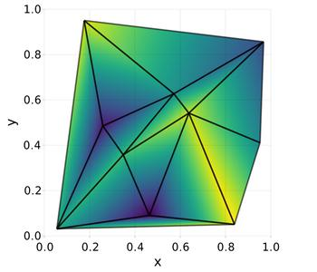
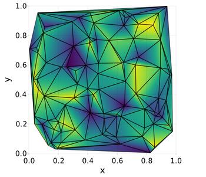

# Delaunay: Find the Delaunay triangulation for a set of points

* [GitHub](https://github.com/eschnett/Delaunay.jl): Source code repository
* [](https://github.com/eschnett/Delaunay.jl/actions)

This package finds the [Delaunay
triangulation](https://en.wikipedia.org/wiki/Delaunay_triangulation)
for a set of points in arbitrary dimensions. It uses
[`scipy.spatial.Delaunay`](https://docs.scipy.org/doc/scipy/reference/generated/scipy.spatial.Delaunay.html)
to perform the actual calculation.

This package is inspired by
[QHull.jl](https://github.com/JuliaPolyhedra/QHull.jl), which uses the
same Python library.

## Example in 2D

```Julia
using Delaunay
points = rand(10, 2)
mesh = delaunay(points)

mesh.points                      # the points
mesh.simplices                   # the simplices (triangles in 2d)
mesh.neighbors                   # neighbouring simplices of a simplex
mesh.vertex_to_simplex           # find a simplex for a point
mesh.convex_hull                 # convex hull of the domain
mesh.vertex_neighbor_vertices    # neighbouring vertices of a vertex

using Makie
color = rand(size(mesh.points, 1))
scene = Makie.mesh(mesh.points, mesh.simplices, color=color, shading=false, scale_plot=false)
xlims!(scene, 0, 1)
ylims!(scene, 0, 1)
wireframe!(scene[end][1], color=(:black, 0.6), linewidth=5)
```




## Example in 3D

```Julia
using Delaunay
points = rand(6, 3)
mesh = delaunay(points)

using Makie
scene = Makie.mesh(mesh.points, mesh.simplices, visible=false)
xlims!(scene, 0, 1)
ylims!(scene, 0, 1)
zlims!(scene, 0, 1)
wireframe!(scene[end][1], color=(:black, 0.6), linewidth=5)
```

The test cases contain also examples in higher dimensions.
